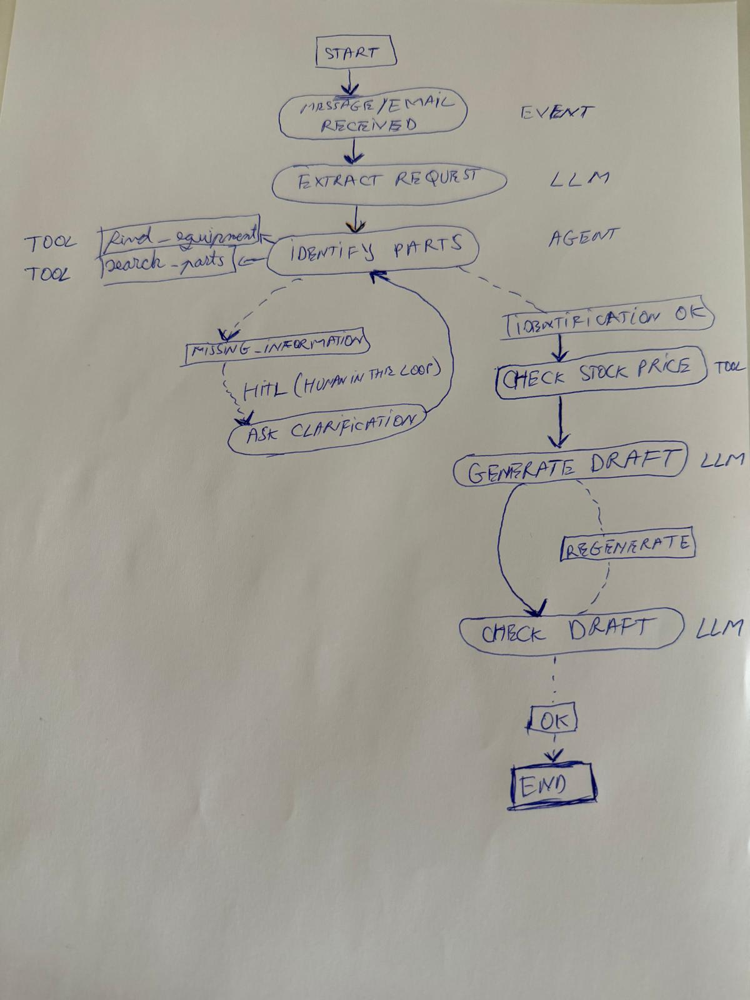

# industrial-sales-agent

## Project purpose

This project builds an AI agent that automates the processing of commercial inquiries received by email from an industrial equipment supplier.

For example, a customer may send:

```text
Hello,

We have an ACX-200 compressor, serial number SN-48392.
We urgently need two oil filters and the gasket for the separator cover.

Could you confirm the part numbers, availability, and price?
```

In practice, messages may contain incomplete or informal information. The customer may provide the equipment model and serial number, describe a part in everyday language, or omit information that is required. The agent must be able to:

- interpret the incoming email;
- identify the customer, equipment, and requested parts;
- confirm the part numbers;
- check stock and pricing for the requested quantity;
- request clarification or operator assistance when information is insufficient;
- generate a draft response for the customer;
- continue processing when a customer replies to a clarification request later.

The project applies concepts from previous courses to make concrete implementation decisions and combine LLM reasoning with deterministic operations on the supplier's data.

## Workflow architecture

The agent does not access the dataset files directly. The LLM decides what information needs to be looked up, while tools perform the deterministic operations:

```text
get_customer(email)
find_equipment(model=None, serial_number=None)
search_parts(query, equipment_id=None)
check_stock(part_number, quantity)
get_price(part_number, customer_id, quantity)
```

Customer identity is important in two operations: `get_customer` identifies the sender, while `get_price` calculates the price associated with the customer. Equipment lookup should also take `customer_id` into account because industrial equipment may be specially configured for each customer. This prevents the same model or serial number from automatically being treated as belonging to any customer.

## Local data

The supplier's systems are simulated using the following files:

```text
data/
├── customers.json
├── equipment.json
├── parts.json
├── inventory.json
└── pricing.json
```

The code skeleton may include:

- `common.py` - tools that read data from the dataset;
- `schema.py` - the main Pydantic types used by the agent;
- `test_cases.jsonl` - test cases covering multiple scenarios;
- `requirements.txt` - project dependencies.

## Workflow execution

Exercises 1, 2 and 3 are some practice for the next exercise. The exercise 4 try to simulate this workflow for an industrial sales agent. 



After the message/email is processed and the important info is extracted [View the Python file](exercices/ex1_extraction.py), it identifies the parts.
Let's assume that the Indentifying Parts Agent [View the Python file](exercices/ex2_agent_react.py) finds 2 candidates and cannot decide safelly. Introduce an interruption which requires human intervantion:
```text
Echipament: ACX-200 / SN-48392

Clientul a solicitat:
"filtrul de ulei"

Piese candidate:

1. P-1042 — Oil Filter 10 μm
2. P-1047 — Oil Filter 25 μm
```
The human operator can select the part and cand decide to ask customer for a clarification. For the missing info, the system will prepare an answer:
```text
Bună ziua,

Pentru a identifica piesa corectă avem nevoie și de seria echipamentului.

Ne-o puteți transmite, vă rog?
```
The workflow execution is waiting...until the customer answer arrives resume the same thread using Command(resume=…), thread_id = request_id, and check the state before and after resumation.
```text
Sigur, seria este SN-48392.
```
After indetifyng parts and checking the stock price, generate a email draft using LLM call. 
```text
Bună ziua,

Pentru compresorul ACX-200, seria SN-48392, am identificat:

* P-1042 — Oil Filter 10 μm — 2 buc.
* G-2210 — Separator Cover Gasket — 1 buc.

Ambele repere sunt disponibile în stoc.

Total: 102 EUR
```
The factual information must be provided from state and tooling results. So, check it in a structured way, DraftValidation class. If the validation fails, the draft is generated only once again. Now, the reply is prepared for sending to the customer